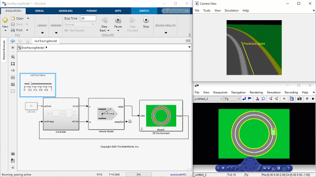
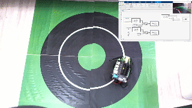

# MATLAB AI ロボティクスワークショップ

  

学生やエンジニアがAIベースの自律移動ロボットをどのように開発するかを学ぶためのハンズオンコンテンツです。ディープラーニングや制御アルゴリズムを3次元シミュレーション環境を通じて直感的に学ぶことを目的にMATLAB&reg; および Simulink&reg; を使用しています。さらにオプションとして NVIDIA&reg; JetBot を使用したハードウェア接続およびスタンドアローン実装もコンテンツとして含んでいます。

[English version](README.md)

## セットアップ
### シミュレーション

MathWorks 製品(http://www.mathworks.com)

MATLAB R2021a もしくは新しいバージョンが必要です。
- [MATLAB&reg;](https://www.mathworks.com/products/matlab.html)
- [Simulink&reg;](https://www.mathworks.com/products/simulink.html)
- [Image Processing Toolbox&trade;](https://www.mathworks.com/products/image.html)
- [Computer Vision Toolbox&trade;](https://www.mathworks.com/products/computer-vision.html)
- [Deep Learning Toolbox&trade;](https://www.mathworks.com/products/deep-learning.html)
- [Parallel Computing Toolbox&trade;](https://www.mathworks.com/products/parallel-computing.html)
- [Robotics System Toolbox&trade;](https://www.mathworks.com/products/robotics.html)

### ハードウェア実装 (*オプション*)

ハードウェア接続およびスタンドアローン実装には下記のMathWorks製品とサードパーティの製品が追加で必要となります。

- [ROS Toolbox](https://www.mathworks.com/products/ros.html)
- [MATLAB Coder&trade;](https://www.mathworks.com/products/matlab-coder.html)
- [Simulink Coder&trade;](https://www.mathworks.com/products/simulink-coder.html)
- [GPU Coder&trade;](https://www.mathworks.com/products/gpu-coder.html)

サードパーティ製品

- [NVIDIA&reg; JetBot](https://www.nvidia.com/en-us/autonomous-machines/embedded-systems/jetbot-ai-robot-kit/) ([FaBoのJetBot](https://www.fabo.store/collections/jetbot/products/jetbot-kit)でテストしています)

## はじめかた

1. MATLABを起動する
2. `matlab_ai_robotics_workshop.prj`を開く
3. ライブスクリプトが開くのでメニューに沿って進める

## ドキュメント

詳細は[PDFドキュメント](doc/AI_Robotics_Workshop_jp.pdf)をご覧ください。

## ライセンス
MATLAB AI Robotics Workshop のライセンスはこのGitHubレポジトリの[license.txt](license.txt) ファイルを参照してください。

## コミュニティサポート
[MATLAB Central](https://www.mathworks.com/matlabcentral)

Copyright 2021 The MathWorks, Inc.